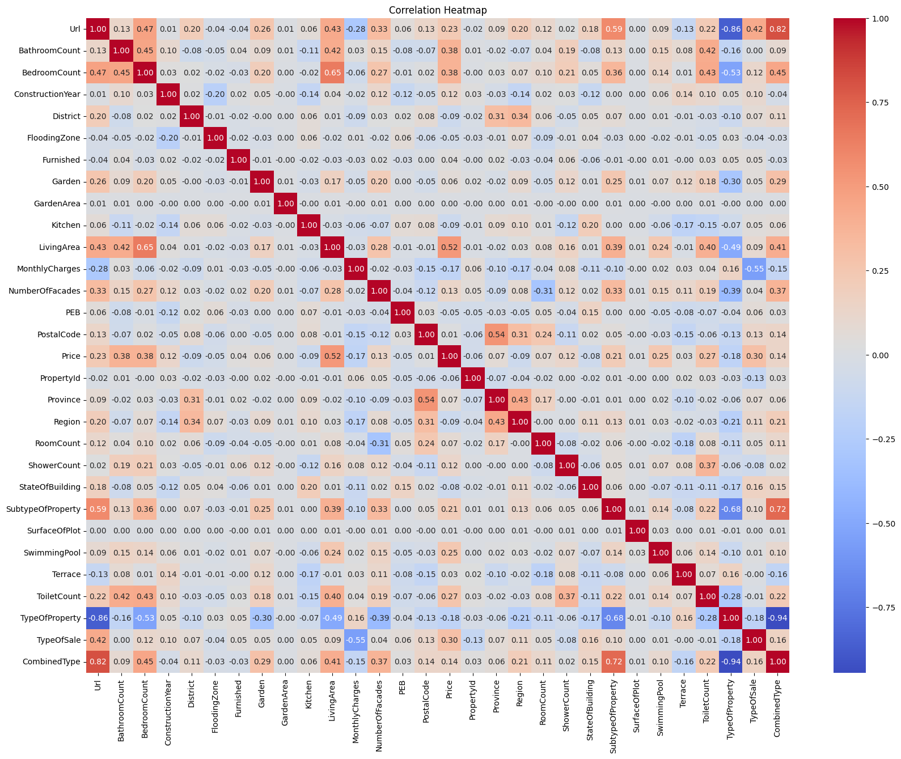

<p align="center">
    <br>
    
    <br>
    <br><br>
    <a></a>
    <h2 align="center">Using:
    <br>
    <br>
    <a href="https://www.python.org/downloads/release/python-3120/"></a>
    <a href="https://www.crummy.com/software/BeautifulSoup/"></a>
    <a href="https://pandas.pydata.org/docs/"></a>
    <br>
</p>

## 📚 Overview

This project focuses on preprocessing and visualizing real estate data for Belgium. It includes scripts for cleaning data, converting categorical data to numerical, splitting datasets, and creating various visualizations. The data includes average rent and sale prices by region, which are used to generate insights and correlations.

## 🕺 Collaborator
Thank you for your contributions to this project : 

- [servietsky0](https://github.com/servietsky0)
- [Siegfried2021](https://github.com/Siegfried2021)
- [KriszgruberL](https://github.com/KriszgruberL)

## 🚧 Project Structure
```
preprocessing-visualization/
├── .vscode/
│   ├── settings.json
├── data/
│   ├── visualization/
│   │   ├── ...
│   ├── clean_dataset.csv
│   ├── final_dataset.json
│   ├── numerical_data.csv
│   └── zipcode-belgium.json
├── preprocessing/
│   ├── categorical_to_num_dict.py
│   ├── clean_data.py
│   ├── df_splitter.py
│   └── preprocessing.py
├── utils/
│   ├── classifier.py
│   ├── property.py
│   └── scrapper.py
├── visualizations/
│   ├── draft copy.ipynb
│   ├── draft.ipynb
│   └── vizualisations.py
├── main.py
├── README.md
└── requirements.txt
```

## ⚒️ Setup

1. **Clone the repository**:
    ```sh
    git clone https://github.com/servietsky0/Preprocessing-Visualization.git
    cd Preprocessing-Visualization
    ```

2. **Create a virtual environment**:
    ```sh
    python -m venv venv
    source venv/bin/activate  
    # On Windows use `venv\Scripts\activate`
    ```

3. **Install the required packages**:
    ```sh
    pip install -r requirements.txt
    ```

## ⚙️ Usage

1. To run the entire preprocessing and visualization pipeline, execute the `main.py` script:
    ```sh
    python main.py
    ```

---
## Visuals


<br>
<br>


---

### 👀 Classes Overview

---

#### **main.py**
The entry point of the application. It initializes data processing and visualization.

**Functions:**
- `main()`: Main function to create instances of the processing classes and execute the processing steps.

---

#### **utils/**
Contains utility scripts for data reading and saving.

- **save_read.py**:
  - `read_to_df(file_path: str, extension: str) -> pd.DataFrame`: Reads the dataset from a file and initializes a DataFrame.
  - `save_df_to_csv(df: pd.DataFrame, file_path: str) -> None`: Saves the DataFrame to a CSV file.

---

#### **preprocessing/**
Contains scripts for preprocessing the dataset.

- **categorical_to_num_dict.py**:
  - `CategoricalNumDict`: Class to handle conversion of categorical data to numerical data.
    - `__init__()`: Initializes the dictionary mappings.
    - `get_dict(key)`: Retrieves the mapping dictionary for a given key.

- **clean_data.py**:
  - `CleanData`: Class to clean the dataset.
    - `__init__(data_path: str, zip_path: str, save_path: str)`: Initializes with paths and settings.
    - `process()`: Executes all processing steps.
    - `fill_empty()`: Fills empty values in the DataFrame.
    - `strip_blank()`: Strips leading and trailing whitespace from string columns.
    - `drop_unusable()`: Drops duplicates and unnecessary columns, and removes rows with null values in critical columns.
    - `check_drop_zip_code()`: Ensures postal codes are valid and drops invalid ones.
    - `check_coherence()`: Ensures data coherence by adjusting certain column values.
    - `get_summary_stats() -> pd.DataFrame`: Returns summary statistics of the DataFrame.
    - `get_data() -> pd.DataFrame`: Returns the processed DataFrame.
    - `get_column() -> pd.Index`: Returns the columns of the DataFrame.

- **df_splitter.py**:
  - `DataFrameSplitter`: Class to split a DataFrame into sub-DataFrames.
    - `__init__()`: Initializes with default conditions and save paths.
    - `split_and_save(df: pd.DataFrame) -> None`: Splits the DataFrame into sub-DataFrames based on conditions and saves them to CSV files.

- **preprocessing.py**:
  - `Preprocessing`: Class to handle preprocessing of data.
    - `__init__(df)`: Initializes with a DataFrame.
    - `transform_categorical(df: pd.DataFrame, dict_key: str, dicts: CategoricalNumDict) -> pd.DataFrame`: Transforms categorical data to numerical.
    - `transform_all_categorical(df: pd.DataFrame, dicts: CategoricalNumDict) -> pd.DataFrame`: Transforms all categorical columns using dictionaries.
    - `get_numerical_data() -> pd.DataFrame`: Returns the transformed numerical data.

---

#### **visualizations/**
Contains scripts for creating visualizations.

- **vizualisations.py**:
  - `Visualizations`: Class to create various visualizations from the dataset.
    - `__init__(data)`: Initializes with a DataFrame and prepares data for visualization.
    - `combine_subtypes(subtype)`: Combines subtypes into 'House' and 'Flat'.
    - `heat_map()`: Creates and saves a heatmap of feature correlations.
    - `plot_totalarea_to_price()`: Plots and saves a bar chart of total living area vs price.
    - `plot_average_sale_price()`: Plots and saves a bar chart of average sale price by region and property type.
    - `plot_average_rent_price()`: Plots and saves a bar chart of average rent price by region and property type.
    - `plot_average_sale_price_region()`: Plots and saves a bar chart of average sale price by region.
    - `plot_average_rent_price_region()`: Plots and saves a bar chart of average rent price by region.
    
    ---

#### **data/**
Contains data files used and generated by the scripts.

- **visualization/**: Directory containing visualization images.
  - `average_rent_price_by_region.png`: Visualization of average rent prices by region.
  - `average_sale_price_by_region.png`: Visualization of average sale prices by region.
  - `correlation_heatmap.png`: Heatmap showing correlations between features.
- `Data_house.xlsx`: Excel file with raw data on houses.
- `clean_dataset.csv`: Cleaned dataset.
- `final_dataset.json`: Final dataset in JSON format.
- `numerical_data.csv`: Numerical data file.
- `zipcode-belgium.json`: JSON file with zipcode data for Belgium.

---
#### **Other Files**

- `.gitignore`: Specifies which files and directories to ignore in Git.
- `Instructions.md`: Contains instructions for the project.
- `README.md`: Provides an overview and instructions for the project.
- `requirements.txt`: Lists required Python packages and their versions.

---


## 📃 Libraries documentation

- [Seaborn](https://seaborn.pydata.org/index.html)
- [Pandas](https://pandas.pydata.org/)

## 🎯 Requirements

- `pandas==2.2.2`
- `numpy==2.0.0`
- `seaborn==0.11.2`
- `scikit-learn`
- `setuptools`

